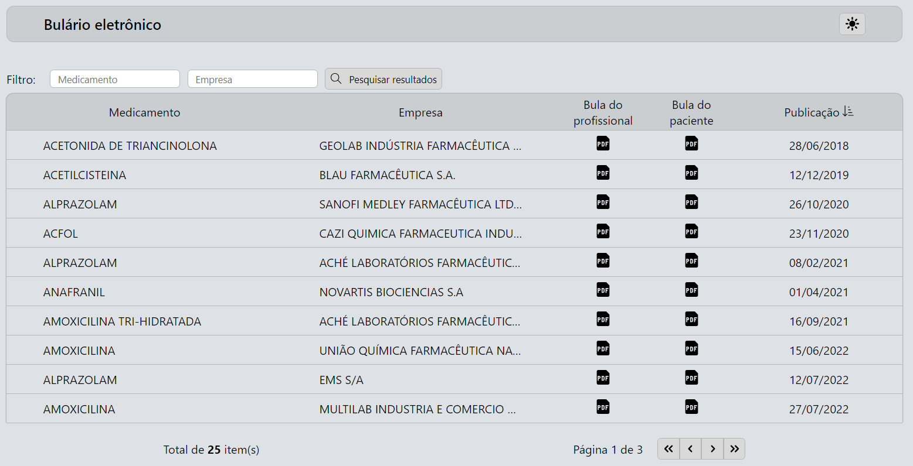
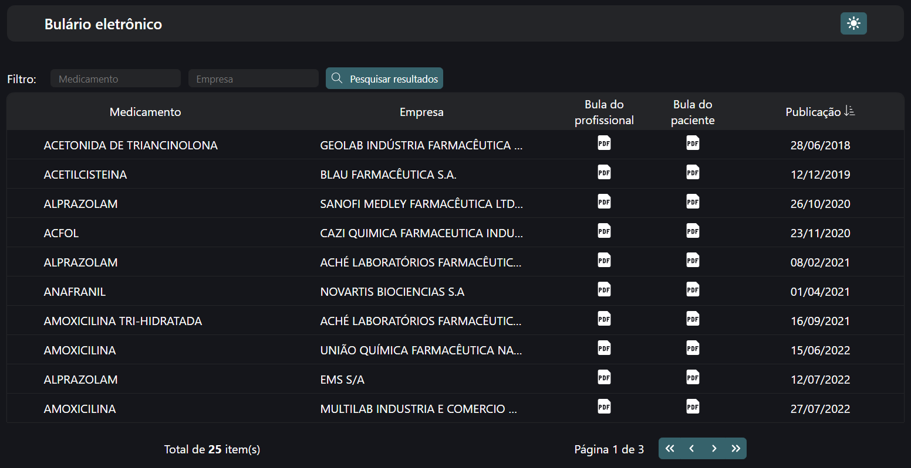
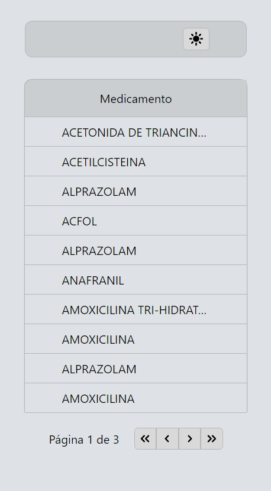
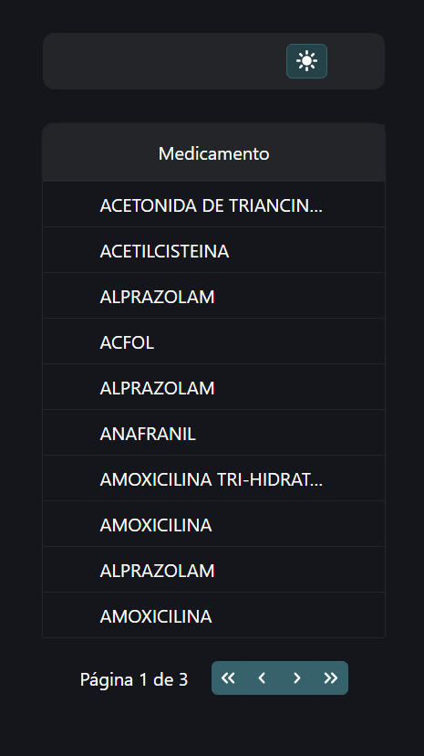

# Sobre o projeto

O projeto consiste em uma aplicação desenvolvida em React utilizando o Vite.js como setup inicial.

## Funcionalidades

-   [x] Consulta por nome do medicamento e/ou laboratório através de query params.
-   [x] Ordenação dos medicamentos pela data de publicação.
-   [x] Paginação de 10 itens por página.
-   [x] Conteúdo fornecido pela API REST na pasta 'api'.
-   [x] Download do PDF da bula.

### Extras

-   [x] Modo escuro.
-   [x] Visualização do PDF na página.
-   [x] Rotas dinâmicas.

## Tecnologias/Ferramentas utilizadas

-   React
-   Typescript
-   React-router-dom
-   Axios
-   Json-server
-   Vite
-   Eslint
-   Prettier

## Como executar o projeto

```
# Clone o projeto e instale as dependências:

$ yarn, npm i ou pnpm i

# Execute o servidor:

$ yarn dev & yarn api, npm run dev & npm run api ou pnpm dev & pnpm api
```

| :exclamation: É necessário executar os servidores em terminais diferentes |
| ------------------------------------------------------------------------- |

## Modelo Web




## Modelo Mobile



